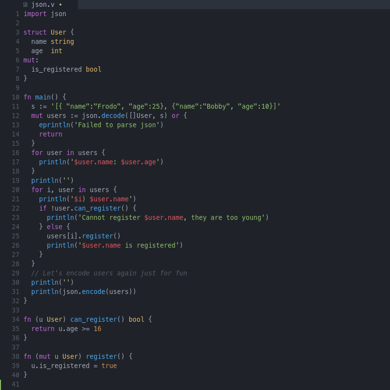

# nvim-vlang

Provides [V language](https://github.com/vlang/v) support for neovim.

## Preview



## Features

- syntax highlighting
- language server using [vls](https://github.com/vlang/vls)

## Install

Using [packer](https://github.com/wbthomason/packer.nvim):
```lua
use 'thecodinglab/nvim-vlang'
```

If you want to enable language server features (such as refactoring), you also need to install the
[neovim lspconfig](https://github.com/neovim/nvim-lspconfig) and the [vls](https://github.com/vlang/vls) language
server:
```lua
use {
  'neovim/nvim-lspconfig',
  config = function()
    require('lspconfig').vlang.setup {}
  end
}
```
